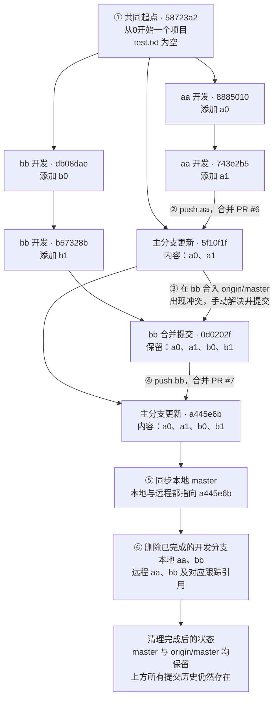

## 提交流程图

  

  

## 各阶段说明

| 阶段            | 实际操作                                | 结果                                              |
| ------------- | ----------------------------------- | ----------------------------------------------- |
| ① 从共同起点开发     | `aa`、`bb` 都从 `58723a2` 开始，各自提交两次    | 功能开发分别进行，主分支尚未接收这些修改                            |
| ② 合并 aa       | 推送 `aa`，通过 PR #6 合入远程 `master`      | 生成 `5f10f1f`，主分支包含 `a0`、`a1`                    |
| ③ bb 同步主分支    | 在 `bb` 合入 `origin/master`，手动解决冲突并提交 | 生成 `0d0202f`，`bb` 同时保留两边内容；此时远程 `master` 没有因此改变 |
| ④ 合并 bb       | 推送 `bb`，通过 PR #7 合入远程 `master`      | 生成 `a445e6b`，主分支包含双方改动                          |
| ⑤ 同步本地 master | 将本地 `master` 快进到远程最新提交              | 本地 `master` 和 `origin/master` 都指向 `a445e6b`     |
| ⑥ 清理开发分支      | 删除本地及远程 `aa`、`bb`，清理远程跟踪引用          | 仅保留主分支；已合并的提交历史与 PR 记录仍保留                       |
